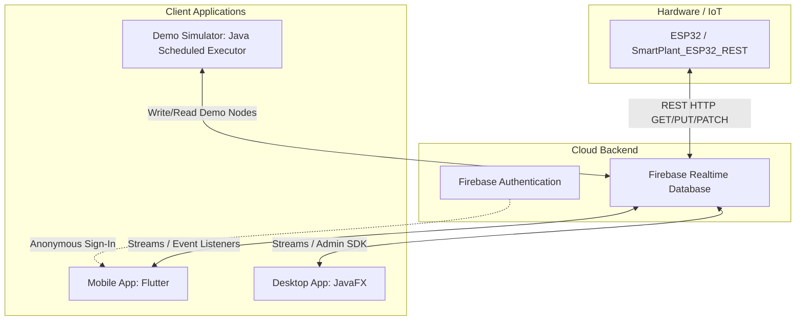

# 📖 Panduan Teknis & Dokumentasi Lengkap GrowBuddy

Selamat datang di Panduan Teknis **GrowBuddy**! Dokumen ini menyediakan referensi lengkap mengenai arsitektur sistem, struktur database Firebase, kode sumber aplikasi **Mobile (Flutter)**, aplikasi **Desktop (JavaFX)**, serta firmware **IoT (ESP32)**.

---

## 🗺️ 1. Arsitektur & Alur Sistem

Sistem GrowBuddy mengintegrasikan perangkat keras (IoT) dengan antarmuka pengguna (Mobile & Desktop) melalui cloud database secara real-time.



### Flow Operasional Utama:
1. **Pengukuran Sensor**: ESP32 membaca kelembaban tanah menggunakan sensor kelembaban analog (Pin 34), mengkalibrasi dengan nilai offset, lalu mengirimkannya via HTTP PATCH ke `/devices/{device_id}`.
2. **Sinkronisasi Data**: Realtime Database memancarkan perubahan ke semua client (Flutter & JavaFX) yang sedang melakukan `listening` (mendengarkan) node tersebut.
3. **Penyiraman Manual (Siram Sekarang)**:
   - Pengguna menekan tombol **Siram Sekarang** di Mobile/Desktop.
   - Aplikasi memvalidasi status online perangkat, lalu memicu modal konfirmasi.
   - Setelah dikonfirmasi, aplikasi menulis `control/siram = true` ke Firebase.
   - **ESP32** (atau **DemoSimulatorService**) mendeteksi perubahan flag tersebut dalam siklus polling 1 detik, menyalakan pompa air fisik (Pin 26) selama durasi yang ditentukan (`pump_duration`), lalu mengembalikan flag `siram` ke `false`.
   - Setelah penyiraman selesai, kelembaban yang baru dibaca kembali dan dikirim ke Firebase, bersamaan dengan penambahan catatan baru di riwayat (`history`) dan pembaruan skor gamifikasi.

---

## 🗃️ 2. Skema & Aturan Realtime Database

### Struktur Data JSON
Data disimpan dalam Firebase Realtime Database menggunakan skema berikut:

```json
{
  "users": {
    "ANONYMOUS_UID": {
      "device_id": "device_001"
    }
  },
  "devices": {
    "device_001": {
      "moisture": 55,
      "status": "Tanaman Sehat",
      "online": true,
      "last_update": 1716010000,
      "fw_version": "esp32-rest-3.1.0",
      "wifi_ssid": "Redmi-15",
      "config": {
        "pump_duration": 5
      },
      "settings": {
        "pump_duration_seconds": 5
      },
      "calibration": {
        "offset_percent": 0
      },
      "game": {
        "level": 3,
        "score": 45
      },
      "history": {
        "history_uuid_8char": {
          "moisture_before": 25,
          "moisture_after": 60,
          "score_delta": 40,
          "timestamp": 1716010050,
          "triggered_by": "admin_desktop"
        }
      }
    }
  }
}
```

### 🔒 Aturan Keamanan Database (Security Rules)
Konfigurasi file aturan keamanan didefinisikan di [database.rules.json](file:///home/syaiful/Kuliah/GrowBuddy/database.rules.json).
Aturan ini membolehkan:
- Membaca dan menulis konfigurasi `/users/$uid` hanya jika terautentikasi dan ID pengguna cocok dengan `$uid`.
- Membaca `/devices/$device_id` bagi pengguna yang terautentikasi dan memiliki relasi di profil `/users`.
- Menulis data sensor dan `control` dengan validasi parameter yang ketat untuk mencegah exploitasi data.

---

## 📱 3. Modul Mobile (Flutter — growbuddy)

Modul mobile didevelop menggunakan **Flutter** dan memanfaatkan pemrograman berbasis objek (**OOP**).

### 🏛️ Penerapan Prinsip OOP pada Flutter
- **Encapsulation (Enkapsulasi)**: Terlihat pada [firebase_service.dart](file:///home/syaiful/Kuliah/GrowBuddy/growbuddy/lib/services/firebase_service.dart). Komponen internal seperti `_auth` dan `_database` dibuat private (`_`), sehingga manipulasi data hanya dapat dilakukan melalui metode publik seperti `triggerWaterNow()` dan `unlinkDevice()`.
- **Abstraction (Abstraksi)**: UI screen tidak perlu memahami REST API atau WebSockets Firebase. UI hanya memanggil `watchDevice()` dan menerima callback data siap pakai.
- **Inheritance (Pewarisan)**: Seluruh tampilan halaman di folder `screens` mewarisi `StatefulWidget` atau `StatelessWidget`.
- **Polymorphism (Polimorfisme)**: Pemanggilan metode `build(BuildContext context)` di-override di setiap class screen untuk menggambar antarmukanya masing-masing.

### 📁 Daftar Halaman Mobile (`lib/screens/`)

1. **[splash_screen.dart](file:///home/syaiful/Kuliah/GrowBuddy/growbuddy/lib/screens/splash_screen.dart)**
   - **Fungsi**: Halaman pembuka beranimasi logo GrowBuddy.
   - **Logika**: Memeriksa durasi splash minimum, lalu mengarahkan ke `auto_login_screen.dart`.
2. **[auto_login_screen.dart](file:///home/syaiful/Kuliah/GrowBuddy/growbuddy/lib/screens/auto_login_screen.dart)**
   - **Fungsi**: Menangani autentikasi anonim di background.
   - **Logika**: Menghubungi `FirebaseService` untuk melakukan sign-in anonim. Jika berhasil, membaca status `device_id` di profil `/users/{uid}`. Jika belum ada device, dialihkan ke `device_selection.dart`, jika sudah ada langsung masuk ke dashboard utama.
3. **[device_selection.dart](file:///home/syaiful/Kuliah/GrowBuddy/growbuddy/lib/screens/device_selection.dart)**
   - **Fungsi**: Membantu pengguna menghubungkan perangkat baru.
   - **Logika**: Menyediakan pilihan input manual atau scan QR Code (simulasi), lalu menuliskan ID perangkat ke Firebase profil pengguna.
4. **[hubungkan_perangkat_tanpa_qr_screen.dart](file:///home/syaiful/Kuliah/GrowBuddy/growbuddy/lib/screens/hubungkan_perangkat_tanpa_qr_screen.dart)**
   - **Fungsi**: Input ID Perangkat secara manual tanpa QR Code.
   - **Logika**: Validasi format teks ID perangkat, dan mengirimkan permintaan penautan ke database.
5. **[device_shell_screen.dart](file:///home/syaiful/Kuliah/GrowBuddy/growbuddy/lib/screens/device_shell_screen.dart)**
   - **Fungsi**: Container utama halaman dengan sistem navigasi bawah.
   - **Logika**: Membungkus navigasi antar sub-halaman menggunakan [grow_bottom_navigation_bar.dart](file:///home/syaiful/Kuliah/GrowBuddy/growbuddy/lib/widgets/grow_bottom_navigation_bar.dart) dan menjaga status halaman yang aktif.
6. **[home_dashboard.dart](file:///home/syaiful/Kuliah/GrowBuddy/growbuddy/lib/screens/home_dashboard.dart)**
   - **Fungsi**: Layar utama monitoring tanaman.
   - **Logika**: Mendengarkan secara real-time data sensor kelembaban, suhu, kelembaban udara, level gamifikasi, dan status online perangkat. Menampilkan tombol "Siram Sekarang" jika status perangkat online.
7. **[watering_confirmation_screen.dart](file:///home/syaiful/Kuliah/GrowBuddy/growbuddy/lib/screens/watering_confirmation_screen.dart)**
   - **Fungsi**: Modal konfirmasi penyiraman.
   - **Logika**: Menampilkan status kelembaban saat ini dan durasi pompa yang dikonfigurasi. Meminta persetujuan akhir sebelum memicu perintah pompa.
8. **[watering_progress_screen.dart](file:///home/syaiful/Kuliah/GrowBuddy/growbuddy/lib/screens/watering_progress_screen.dart)**
   - **Fungsi**: Tampilan animasi saat proses penyiraman berlangsung.
   - **Logika**: Mendengarkan perubahan `control/execution_status` di Firebase. Saat status berubah dari `running` menjadi `completed`, otomatis melompat ke halaman hasil.
9. **[watering_result_screen.dart](file:///home/syaiful/Kuliah/GrowBuddy/growbuddy/lib/screens/watering_result_screen.dart)**
   - **Fungsi**: Menampilkan ringkasan hasil penyiraman tanaman.
   - **Logika**: Membaca entri riwayat terakhir untuk menampilkan peningkatan kelembaban tanah (%) dan bonus skor gamifikasi yang diperoleh.
10. **[history_screen.dart](file:///home/syaiful/Kuliah/GrowBuddy/growbuddy/lib/screens/history_screen.dart)**
    - **Fungsi**: Menampilkan riwayat grafik kelembaban dan log aksi penyiraman.
    - **Logika**: Mengambil daftar data riwayat dari node `devices/{deviceId}/history` dan memvisualisasikannya dalam bentuk grafik interaktif.
11. **[missions_screen.dart](file:///home/syaiful/Kuliah/GrowBuddy/growbuddy/lib/screens/missions_screen.dart)**
    - **Fungsi**: Fitur gamifikasi tugas/misi harian (misal: "Siram tanaman di kelembaban kritis").
    - **Logika**: Menghitung pencapaian misi berdasarkan data statistik kelembaban tanah dan log aktivitas di Firebase.
12. **[notifications_screen.dart](file:///home/syaiful/Kuliah/GrowBuddy/growbuddy/lib/screens/notifications_screen.dart)**
    - **Fungsi**: Daftar notifikasi aktivitas sistem (misal: "Alat terputus", "Tanah sangat kering").
    - **Logika**: Menampilkan log notifikasi real-time yang dihasilkan oleh pergerakan data sensor di database.
13. **[settings_screen.dart](file:///home/syaiful/Kuliah/GrowBuddy/growbuddy/lib/screens/settings_screen.dart)**
    - **Fungsi**: Pengaturan profil pengguna, konfigurasi pompa, dan unlink perangkat.
    - **Logika**: Menyediakan form untuk mengupdate durasi pompa, mengatur kalibrasi offset sensor, dan menghapus penautan perangkat (`unlinkDevice()`).
14. **[calibration_screen.dart](file:///home/syaiful/Kuliah/GrowBuddy/growbuddy/lib/screens/calibration_screen.dart)**
    - **Fungsi**: Kalibrasi sensor kelembaban secara manual.
    - **Logika**: Mengirimkan nilai penyesuaian offset ke node `/devices/{deviceId}/calibration/offset_percent` agar diterapkan langsung oleh ESP32.
15. **[admin_login_screen.dart](file:///home/syaiful/Kuliah/GrowBuddy/growbuddy/lib/screens/admin_login_screen.dart)**
    - **Fungsi**: Login khusus untuk Admin pengawas.
    - **Logika**: Otentikasi dengan kredensial administrator.
16. **[admin_dashboard_screen.dart](file:///home/syaiful/Kuliah/GrowBuddy/growbuddy/lib/screens/admin_dashboard_screen.dart)**
    - **Fungsi**: Dashboard kontrol multi-perangkat bagi administrator.
    - **Logika**: Memonitor seluruh node perangkat di `/devices` secara serentak.

---

## 💻 4. Modul Desktop (JavaFX — growbuddy_desktop)

Aplikasi desktop dibangun menggunakan JavaFX SDK dengan integrasi **Firebase Admin SDK** (melalui Service Account credential) dan arsitektur kontroler FXML.

### 🏛️ Struktur Arsitektur JavaFX & Mappings
Setiap halaman desktop memisahkan antarmuka (file XML di `/resources/fxml/`) dengan pengontrol logika di `/java/com/bongs20/growbuddy/controllers/`.

```text
growbuddy_desktop
├── src/main/java/com/bongs20/growbuddy
│   ├── Main.java                        <-- Entry Point & Scene Router
│   ├── controllers                      <-- Logika Antarmuka (JavaFX)
│   └── services                         <-- Firebase, Simulator, & Notifikasi
└── src/main/resources
    ├── serviceAccountKey.json           <-- Firebase Credentials (ADMIN SDK)
    └── fxml                             <-- Desain Antarmuka (XML Layouts)
```

### 📁 Daftar Controller & FXML Mappings

| No | Nama Controller Class | File Layout FXML | Penjelasan Fungsi & Logika Kode |
|:---|:---|:---|:---|
| 1 | **[Main.java](file:///home/syaiful/Kuliah/GrowBuddy/growbuddy_desktop/src/main/java/com/bongs20/growbuddy/Main.java)** | `SplashScreen.fxml` | Mengatur window utama, routing antar Scene (`navigateToDashboard()`, `navigateToDeviceSelection()`, dll.), serta manajemen kemunculan popup modal (`showModal()`, `closeModal()`). |
| 2 | **[SplashScreenController.java](file:///home/syaiful/Kuliah/GrowBuddy/growbuddy_desktop/src/main/java/com/bongs20/growbuddy/controllers/SplashScreenController.java)** | `SplashScreen.fxml` | Menampilkan logo animasi awal dan memastikan dependencies terinisialisasi dengan benar sebelum melompat ke Login. |
| 3 | **[AutoLoginController.java](file:///home/syaiful/Kuliah/GrowBuddy/growbuddy_desktop/src/main/java/com/bongs20/growbuddy/controllers/AutoLoginController.java)** | `AutoLogin.fxml` | Mensimulasikan proses login pengguna desktop dan memvalidasi penautan `device_id` di Firebase. |
| 4 | **[DeviceSelectionController.java](file:///home/syaiful/Kuliah/GrowBuddy/growbuddy_desktop/src/main/java/com/bongs20/growbuddy/controllers/DeviceSelectionController.java)** | `DeviceSelection.fxml` | Halaman utama pemilihan perangkat; memisahkan aliran antara menghubungkan perangkat fisik asli atau memulai perangkat **Demo Simulator**. |
| 5 | **[ConnectDeviceManualController.java](file:///home/syaiful/Kuliah/GrowBuddy/growbuddy_desktop/src/main/java/com/bongs20/growbuddy/controllers/ConnectDeviceManualController.java)** | `ConnectDeviceManual.fxml` | Menyediakan antarmuka input string manual untuk ID perangkat keras. |
| 6 | **[MainLayoutController.java](file:///home/syaiful/Kuliah/GrowBuddy/growbuddy_desktop/src/main/java/com/bongs20/growbuddy/controllers/MainLayoutController.java)** | `MainLayout.fxml` | Shell layout desktop yang berisi sidebar menu. Menangani pertukaran sub-view FXML di dalam `contentArea` (StackPane) secara dinamis. Mendengarkan disconnect event untuk notifikasi sistem. |
| 7 | **[HomeDashboardController.java](file:///home/syaiful/Kuliah/GrowBuddy/growbuddy_desktop/src/main/java/com/bongs20/growbuddy/controllers/HomeDashboardController.java)** | `HomeDashboard.fxml` | Menampilkan data kelembaban tanah real-time (ProgressBar & Label), status teks, game level, status online (aktif/nonaktif tombol siram) melalui sinkronisasi thread `Platform.runLater()`. |
| 8 | **[WateringConfirmationController.java](file:///home/syaiful/Kuliah/GrowBuddy/growbuddy_desktop/src/main/java/com/bongs20/growbuddy/controllers/WateringConfirmationController.java)** | `WateringConfirmation.fxml` | Memuat data kelembaban sensor & konfigurasi durasi pompa, menampilkan konfirmasi sebelum menyiram, dan menulis `control/siram = true` via `FirebaseService`. |
| 9 | **[WateringProgressController.java](file:///home/syaiful/Kuliah/GrowBuddy/growbuddy_desktop/src/main/java/com/bongs20/growbuddy/controllers/WateringProgressController.java)** | `WateringProgress.fxml` | Mengunci antarmuka dengan progress bar berputar tak tentu (`indeterminate`), mendengarkan sinyal reset dari device/simulator untuk meluncurkan modal hasil. |
| 10 | **[WateringResultController.java](file:///home/syaiful/Kuliah/GrowBuddy/growbuddy_desktop/src/main/java/com/bongs20/growbuddy/controllers/WateringResultController.java)** | `WateringResult.fxml` | Membaca catatan riwayat (`history`) terbaru yang baru saja disimpan untuk menyajikan persentase kelembaban tanah setelah disiram dan delta skor game. |
| 11 | **[HistoryController.java](file:///home/syaiful/Kuliah/GrowBuddy/growbuddy_desktop/src/main/java/com/bongs20/growbuddy/controllers/HistoryController.java)** | `History.fxml` | Mengambil data log dari Firebase untuk merender daftar tabel riwayat aksi penyiraman tanaman secara kronologis. |
| 12 | **[MissionsController.java](file:///home/syaiful/Kuliah/GrowBuddy/growbuddy_desktop/src/main/java/com/bongs20/growbuddy/controllers/MissionsController.java)** | `Missions.fxml` | Mengolah skor pengguna di Firebase dan memperbarui visualisasi papan pencapaian misi. |
| 13 | **[NotificationsController.java](file:///home/syaiful/Kuliah/GrowBuddy/growbuddy_desktop/src/main/java/com/bongs20/growbuddy/controllers/NotificationsController.java)** | `Notifications.fxml` | Menyajikan daftar aktivitas sistem dan logs notifikasi. |
| 14 | **[SettingsController.java](file:///home/syaiful/Kuliah/GrowBuddy/growbuddy_desktop/src/main/java/com/bongs20/growbuddy/controllers/SettingsController.java)** | `Settings.fxml` | Kontrol pusat setelan desktop. Membuka modal edit profil, ubah durasi pompa, kalibrasi, dan menangani pemutusan perangkat (`unlinkDevice`). |
| 15 | **[EditProfileController.java](file:///home/syaiful/Kuliah/GrowBuddy/growbuddy_desktop/src/main/java/com/bongs20/growbuddy/controllers/EditProfileController.java)** | `EditProfileModal.fxml` | Modal input untuk mengubah data profil pengguna. |
| 16 | **[EditPumpDurationController.java](file:///home/syaiful/Kuliah/GrowBuddy/growbuddy_desktop/src/main/java/com/bongs20/growbuddy/controllers/EditPumpDurationController.java)** | `EditPumpDurationModal.fxml` | Modal input numerik untuk memodifikasi durasi jalannya pompa air. |
| 17 | **[CalibrationController.java](file:///home/syaiful/Kuliah/GrowBuddy/growbuddy_desktop/src/main/java/com/bongs20/growbuddy/controllers/CalibrationController.java)** | `Calibration.fxml` | Mengubah parameter kalibrasi offset sensor tanah. |
| 18 | **[AdminLoginController.java](file:///home/syaiful/Kuliah/GrowBuddy/growbuddy_desktop/src/main/java/com/bongs20/growbuddy/controllers/AdminLoginController.java)** | `AdminLogin.fxml` | Autentikasi untuk panel kontrol administrator desktop. |
| 19 | **[AdminDashboardController.java](file:///home/syaiful/Kuliah/GrowBuddy/growbuddy_desktop/src/main/java/com/bongs20/growbuddy/controllers/AdminDashboardController.java)** | `AdminDashboard.fxml` | Menyajikan list grid seluruh perangkat IoT yang aktif, status kelembaban tanah, status koneksi online, serta kontrol pembersihan riwayat secara massal. |

### 🛠️ Daftar Services Desktop (`lib/services/`)

- **[FirebaseService.java](file:///home/syaiful/Kuliah/GrowBuddy/growbuddy_desktop/src/main/java/com/bongs20/growbuddy/services/FirebaseService.java)**
  - Singleton yang menginisialisasi koneksi SDK Firebase Admin menggunakan [serviceAccountKey.json](file:///home/syaiful/Kuliah/GrowBuddy/growbuddy_desktop/src/main/resources/serviceAccountKey.json).
  - Menyediakan fungsionalitas CRUD database Firebase real-time: `watchDevice()`, `unwatchDevice()`, `watchHistory()`, `triggerWaterNow()`, dan `watchAllDevices()`.
- **[DemoSimulatorService.java](file:///home/syaiful/Kuliah/GrowBuddy/growbuddy_desktop/src/main/java/com/bongs20/growbuddy/services/DemoSimulatorService.java)**
  - Mesin simulator perangkat offline berteknologi tinggi bagi pengujian mandiri tanpa board ESP32 fisik.
  - Menggunakan `ScheduledExecutorService` untuk menjalankan background thread berulang (daemon):
    1. Mengurangi kelembaban (`moisture`) sebesar 1 poin setiap 5 detik.
    2. Memperbarui status deskripsi tanaman secara dinamis berdasarkan persentase kelembaban saat ini ("Tanah kering! Siram segera", "Perlu disiram", "Tanaman Sehat").
    3. Mendengarkan permintaan siram (`control/siram = true`). Ketika mendeteksi trigger, mensimulasikan jeda penyiraman 3 detik, menaikkan kelembaban sebesar 35%, mengalokasikan bonus poin gamifikasi ke level/score game, mencatat log di `/history`, dan membersihkan flag penyiraman kembali ke `false`.
- **[NotificationService.java](file:///home/syaiful/Kuliah/GrowBuddy/growbuddy_desktop/src/main/java/com/bongs20/growbuddy/services/NotificationService.java)**
  - Menggunakan API SystemTray sistem operasi untuk memunculkan notifikasi pop-up native desktop saat perangkat IoT terputus (`offline`) atau berada pada status kelembaban tanah yang kritis.

---

## 🔌 5. Firmware IoT (ESP32 — esp32)

Firmware IoT ditulis dalam bahasa C++ menggunakan Arduino IDE / VSCode PlatformIO dan ditempatkan di [SmartPlant_ESP32_REST.ino](file:///home/syaiful/Kuliah/GrowBuddy/esp32/SmartPlant_ESP32_REST/SmartPlant_ESP32_REST.ino).

### 🛠️ Konfigurasi Pin & Konstanta Hardware
- **Pin Sensor Kelembaban (Analog)**: `SOIL_PIN = 34`
- **Pin Driver Pompa Relai (Digital)**: `PUMP_PIN = 26`
- **Ambang Batas ADC Analog**:
  - Kering (`SOIL_RAW_DRY`) = `3200`
  - Basah (`SOIL_RAW_WET`) = `1400`
- **Interval Operasional (Non-Blocking)**:
  - Pembacaan sensor (`SAMPLE_INTERVAL_MS`) = `10000` (10 detik)
  - Polling perintah siram (`CONTROL_POLL_INTERVAL_MS`) = `1000` (1 detik)
  - Pencegahan spam penyiraman (`WATER_COOLDOWN_MS`) = `5000` (5 detik)
  - Status online perangkat (`HEARTBEAT_INTERVAL_MS`) = `10000` (10 detik)
  - Sinkronisasi setelan awan (`CONFIG_FETCH_INTERVAL_MS`) = `30000` (30 detik)

### ⚙️ Alur Kerja & Fungsi Utama Firmware
1. **`setup()`**: Inisialisasi pin input/output, koneksi WiFi STA (mengurangi daya pemancar hingga 8.5dBm untuk keandalan catu daya), sinkronisasi jam global via NTP (Network Time Protocol), memanggil `fetchConfig()`, dan melaporkan status online pertama kali.
2. **`loop()`**: Menjalankan siklus penjadwalan non-blocking menggunakan fungsi bawaan `millis()` untuk efisiensi daya dan responsivitas hardware:
   - **Membaca Kelembaban**: Memetakan nilai mentah ADC sensor analog ke skala `0 - 100%` dengan fungsi `map()`, menambahkan nilai offset kalibrasi (`calibrationOffset`), lalu membatasi hasilnya di range `0 - 100%` menggunakan `constrain()`.
   - **Polling Perintah Siram**: Melakukan HTTP GET ke `/devices/{device_id}/control.json` setiap 1 detik. Jika `siram == true`:
     1. Menulis data penyetelan balik via HTTP PUT (`control/siram = false`) ke Firebase untuk mencegah pemrosesan ulang.
     2. Menyalakan relai pompa air (`digitalWrite(PUMP_PIN, HIGH)`).
     3. Menggunakan non-blocking timer untuk mematikan pompa secara otomatis setelah `pumpDuration` milidetik terlampaui, lalu memperbarui status kelembaban pasca penyiraman di Firebase.
   - **Heartbeat & Sinkronisasi Konfigurasi**: Secara periodik melaporkan status hidup perangkat serta melakukan polling konfigurasi `/settings` dan `/calibration` untuk menyelaraskan durasi pompa dan offset kalibrasi jika sewaktu-waktu diubah oleh pengguna via aplikasi.
